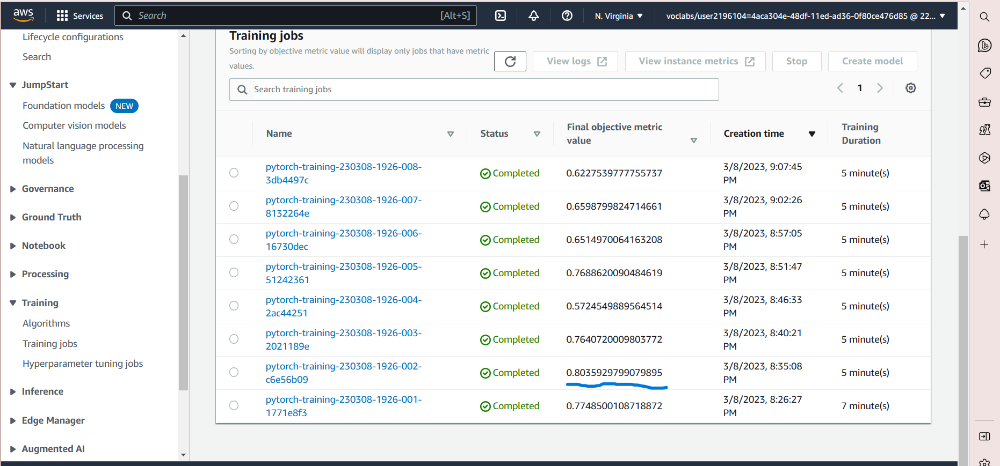
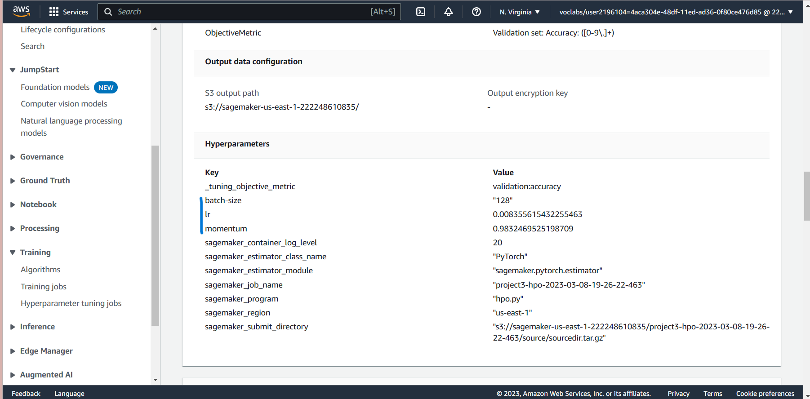
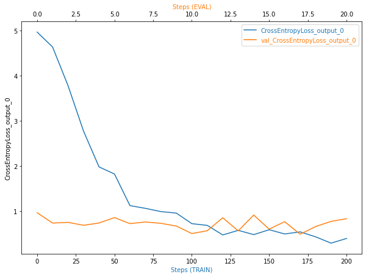
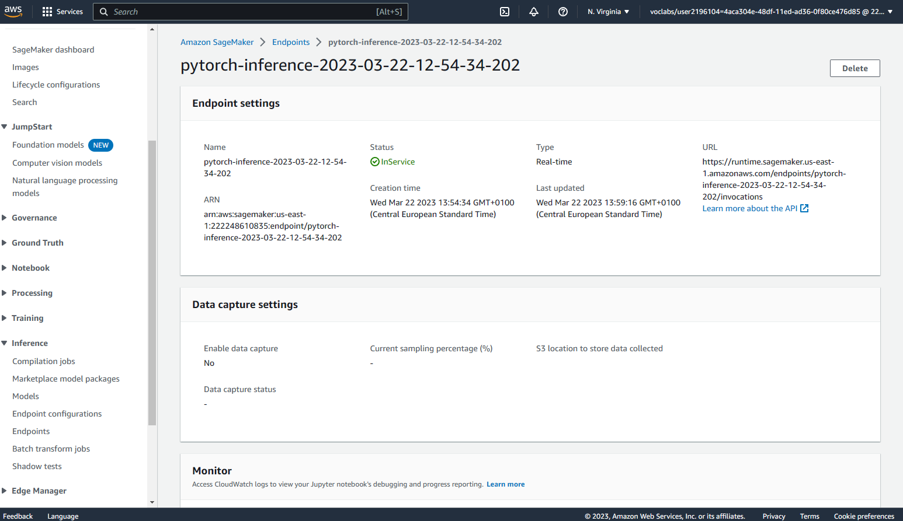

# Image Classification using AWS SageMaker

In this project I have used AWS Sagemaker to finetune a pretrained model that can perform image classification by using the Sagemaker profiling, debugger, hyperparameter tuning and other ML engineering practices. 

## Dataset
I have decided to use recommended dataset of dog breeds which can be found [here](https://s3-us-west-1.amazonaws.com/udacity-aind/dog-project/dogImages.zip). I have downloaded the dataset, displayed some sample images and uploaded the data into my own S3 bucket in an appropriate format 

### Access
I uploaded the data to an S3 bucket through the AWS Gateway so that SageMaker has access to the data. 

## Hyperparameter Tuning
For this task I have chosen to use pretrained model. It would have been too cumbersome and would have taken lots of billing time to actually build and finetune a Convolutional Neural Network from scratch. Additionally I do not have enough images to train the model from scratch. I have used pretrained Resnet50 model and added 1 fully connected layer (which I will train) on top. Resnet50 shows good performance and is easy to optimize.

I have decided to tune 3 hyperparameters:
1. learning rate - essential hyperparameter which can alone decide whether the training process will converge to certain set of weights and accuracy or lead to some unwanted consequences like divergence of the model or the model converging too slow.
2. momentum - important hyperparameter which optimizes and accelerates gradient descent algorithm updating NN weights
3. batch size - hyperparameter of gradient descent used to set the number of training samples that a model can run before updating its weights. Too small batch size can lead to overfitting while too big batch size can cause underfitting. 

I have selected the following ranges for the above mentioned hyperparameters:
1. learning rate - [0.001;0.01]
2. momentum - [0;0.99]
3. batch size - list of values - 16, 32, 64, 128, 256

Below is the screenshot of hyperparameters tuning jobs. I have highlighted the best objective metric value (accuracy):

I have opened respective training job and highlighted tuned hyperparameters (see screenshot below):

The same parameters and training job name are retrieved in the code.

## Debugging and Profiling
I have trained a model with the best hyperparameters found during hyperparameter tuning step. 
I have added the following Profiler rules which are supposed to capture possible issues of training:
1. vanishing_gradient
2. overfit
3. overtraining
4. poor_weight_initialization
5. loss_not_decreasing

and Debugger hooks for CrossEntropyLoss_output_0 tensor which is supposed to save values of loss function during Training and Evaluation phases of the training. 

The Profiler rules has been directly added to the estimator constructor as a parameter.

### Results
The graph with the training and validation loss change over trainng iterations is below

As per profiler ouput there is an issue with loss not decreasing. I guess the learning rate might be too big. So I could decrease the learning rate next time I run the training job. The initializing part takes far too long - more than 70% of all the time. Actually I am not sure how to fix this one. The GPU has not utilized its the resources efficiently. As suggested I could increase the batch size.

Profiler file has been attached.

## Model Deployment
The model has been deployed to an endpoint 

The model predicts a breed of a dog race on a given picture. There are 133 races the model can predict. The accuracy of the prediction calculated on test dataset is 79%. 
In order to query the endpoint, a filename along with its full path (variable "full_path") in S3 bucket should be provided. Then run all the cells (see comments to see the prediction. You can also provide correct breed (correct_breed) and correct index (correct_index) in order to compare the results of the prediction.
